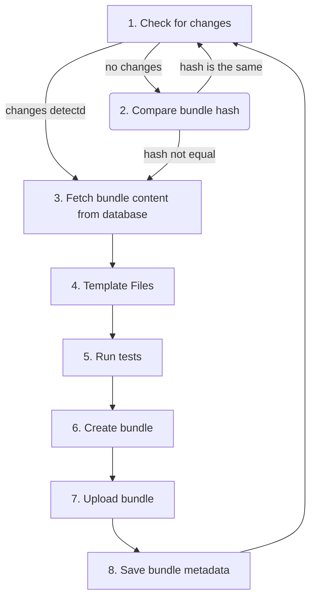

# OPA - Libot Authentication
This monorepo, opa-la for short is where all the MapColonies related authentication lies. 

## Goal
The main idea of the repo is to store authentication data and create [Open Policy Agent](https://www.openpolicyagent.org/) (OPA in short) bundles when the data changes. After a bundle was created we upload them to S3 so OPA can fetch them using the [bundles API](https://www.openpolicyagent.org/docs/latest/management-bundles/).

## Packages
- **auth-core**: A package all the common stuff like Types and Database entities are located.
- **auth-bundler**: A package for handling the creation of new bundles from the database.
- **auth-manager**: Express based API for managing the authentication data.
- **auth-cron**: A server for checking and updating bundles based on cron schedule.

## Development
Before we start making any changes to the repository, we need to bootstrap the repository. To do so we need to run the following commands:
```bash
npm install && npx lerna run build
```

## Documentation
All the code packages in the monorepo are documented using TypeDoc. The auto generated site is available at [here](https://mapcolonies.github.io/opa-la/).

## How it works

1. Based on a cron schedule, we check if any of the relevant data changed since the last package was created ([Connection](https://mapcolonies.github.io/opa-la/interfaces/_map_colonies_auth_core.IConnection.html), [Asset](https://mapcolonies.github.io/opa-la/interfaces/_map_colonies_auth_core.IAsset.html) or [Key](https://mapcolonies.github.io/opa-la/interfaces/_map_colonies_auth_core.IKey.html)).
2. If no changes in the data were detected, we compare the hash saved in the database with object stored in S3. If they are not equal, we still need to generate the bundle.
3. Fetching all the data from the database.
4. If a file is marked for templating - we do this now.
5. We run the OPA tests (if any exist) using the OPA CLI.
6. We create the bundle tarball using the OPA CLI.
7. The created bundle is uploaded to the Object Storage specified in the configuration.
8. If needed, we save the bundle metadata into the database.

## Bundle structure
The bundle is made of all the the policy files, the data files based on the path parameter, and the public key under the keys key.

The example found in the repository shows the usage of the bundle.

## Templates
When an Asset is marked as templated, we use a rendering engine to render it into the final Asset.
The context of the rendering process (object given as parameter for the engine) is an array of all the [Connections](https://mapcolonies.github.io/opa-la/interfaces/_map_colonies_auth_core.IConnection.html) that are relevant for the bundle environment.

For more information about the rendering engine check [templating-engine](packages/auth-bundler/README.md#templating-engine).


